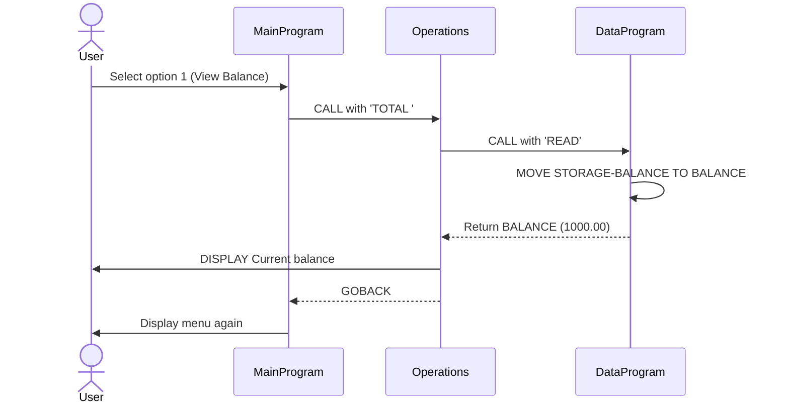
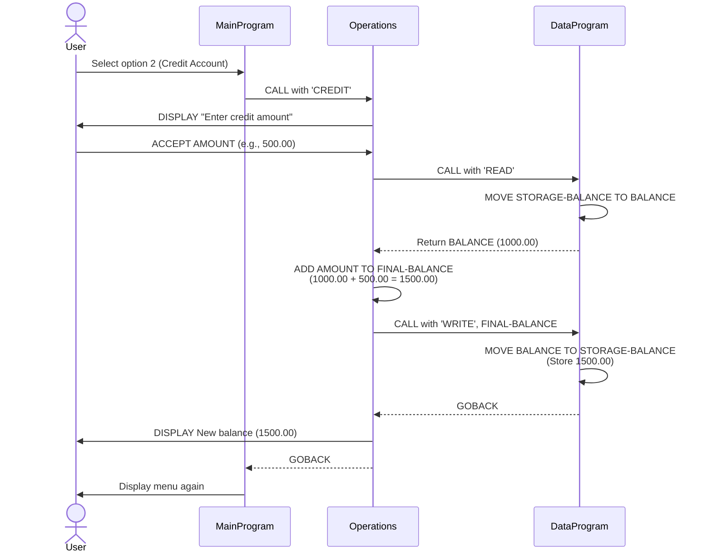
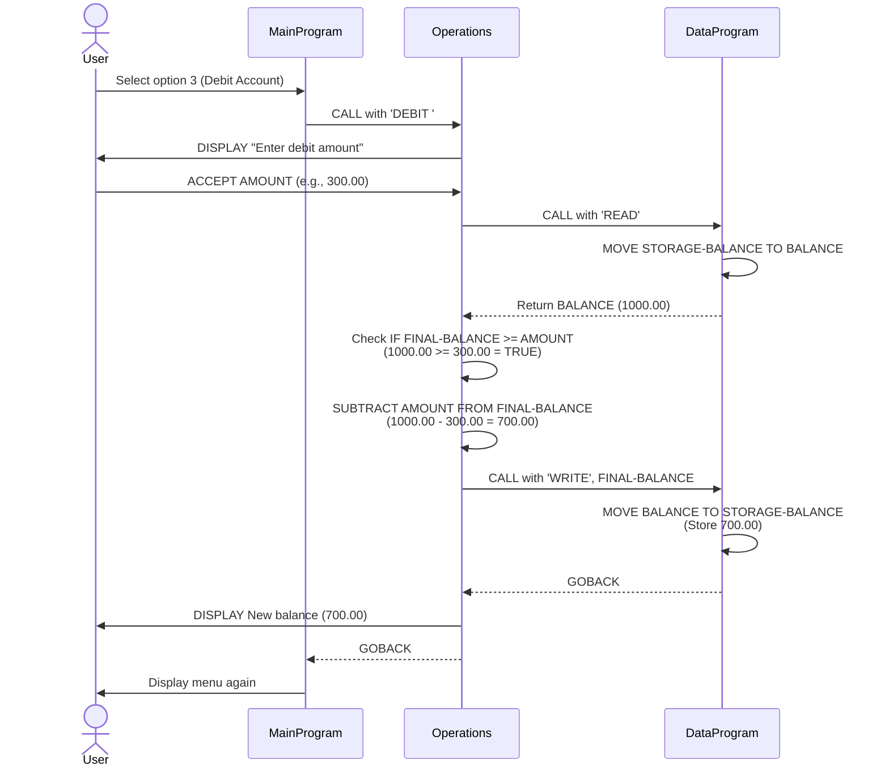
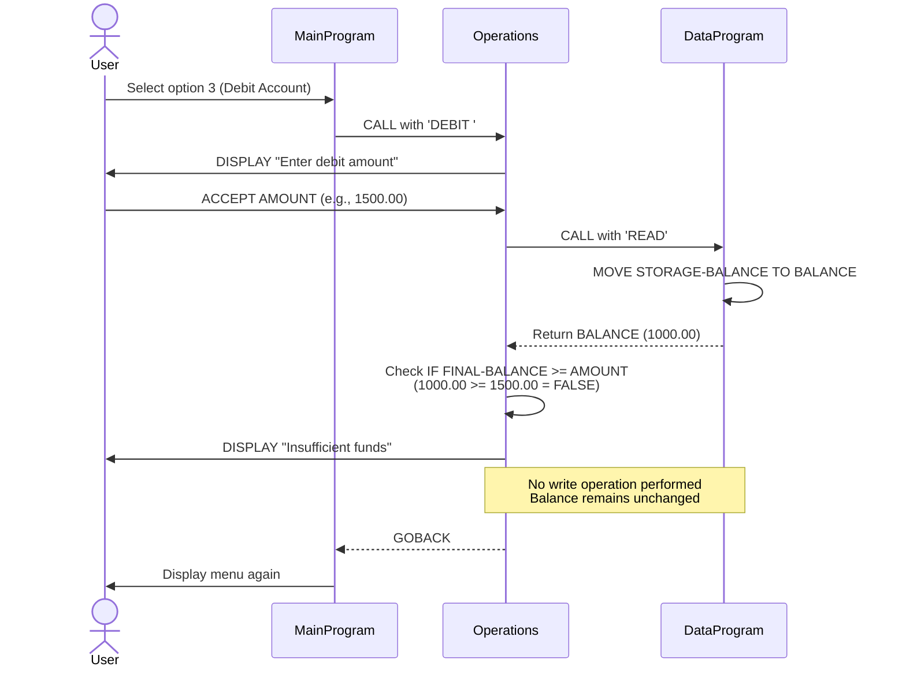
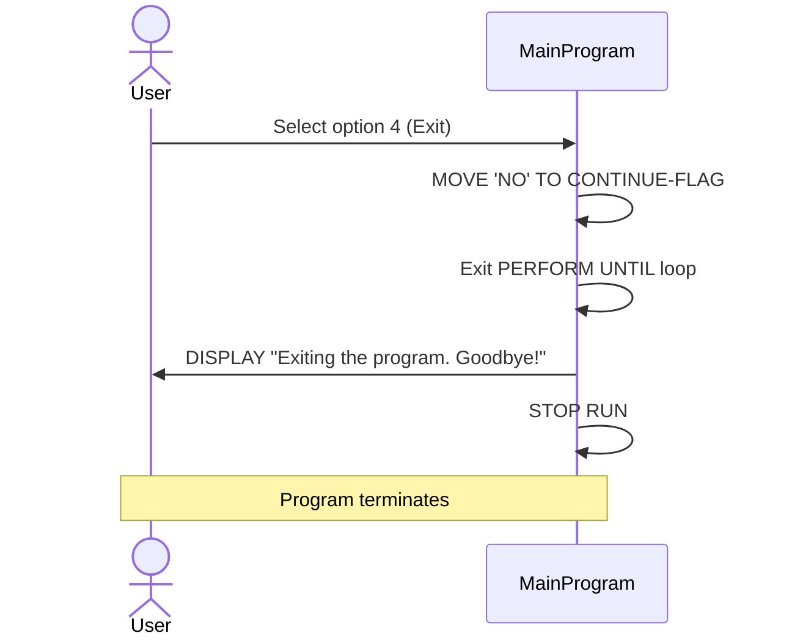
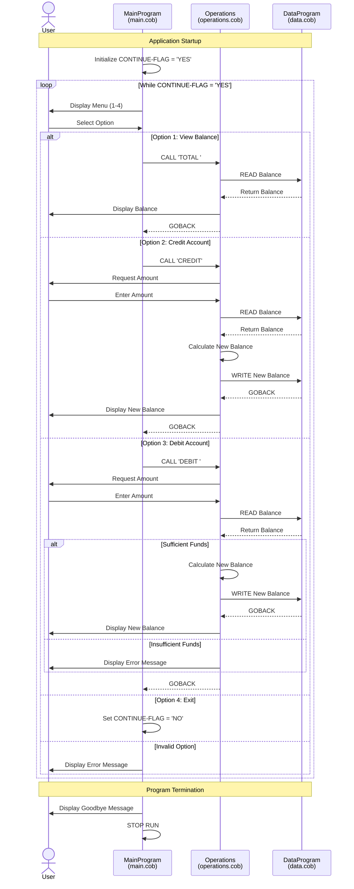

# COBOL Account Management System Documentation

## Overview

This COBOL application implements a simple student account management system that allows users to view balances, credit accounts, and debit accounts. The system uses a modular design with three separate COBOL programs that work together to manage account operations and data persistence.

## System Architecture

The application follows a three-tier architecture pattern:
- **main.cob**: User interface and menu system
- **operations.cob**: Business logic layer
- **data.cob**: Data access layer

## File Descriptions

### 1. main.cob (MainProgram)

**Purpose**: Entry point and user interface controller for the account management system.

**Key Functions**:
- Displays interactive menu with four options
- Accepts and validates user input
- Routes user requests to the appropriate operations
- Controls the main program loop

**Data Structures**:
- `USER-CHOICE` (PIC 9): Stores the user's menu selection (1-4)
- `CONTINUE-FLAG` (PIC X(3)): Controls the main program loop ('YES' or 'NO')

**Menu Options**:
1. View Balance - Displays current account balance
2. Credit Account - Adds funds to the account
3. Debit Account - Withdraws funds from the account
4. Exit - Terminates the program

**Business Rules**:
- User input must be between 1-4
- Invalid selections display an error message and re-prompt the user
- The program runs in a continuous loop until the user selects option 4 (Exit)
- All account operations are delegated to the Operations program

---

### 2. operations.cob (Operations)

**Purpose**: Business logic layer that handles all account operations including balance inquiries, credits, and debits.

**Key Functions**:

#### View Balance (TOTAL)
- Retrieves current balance from data layer
- Displays balance to user
- No modifications to account balance

#### Credit Account (CREDIT)
- Prompts user for credit amount
- Retrieves current balance
- Adds credit amount to balance
- Persists updated balance
- Displays new balance

#### Debit Account (DEBIT)
- Prompts user for debit amount
- Retrieves current balance
- Validates sufficient funds availability
- Subtracts debit amount if funds are sufficient
- Persists updated balance
- Displays new balance or insufficient funds message

**Data Structures**:
- `OPERATION-TYPE` (PIC X(6)): Stores the operation to perform ('TOTAL ', 'CREDIT', 'DEBIT ')
- `AMOUNT` (PIC 9(6)V99): Stores the transaction amount (up to 999999.99)
- `FINAL-BALANCE` (PIC 9(6)V99): Working storage for balance calculations (default: 1000.00)

**Business Rules**:
- **Initial Balance**: All accounts start with a balance of 1000.00
- **Maximum Balance**: 999,999.99 (enforced by data type)
- **Maximum Transaction Amount**: 999,999.99 (enforced by data type)
- **Debit Validation**: Debits are only processed if sufficient funds are available
- **Insufficient Funds**: If a debit amount exceeds the current balance, the transaction is rejected and the balance remains unchanged
- **All operations interact with the data layer**: No direct balance manipulation in this layer

---

### 3. data.cob (DataProgram)

**Purpose**: Data access layer responsible for maintaining and persisting account balance information.

**Key Functions**:

#### Read Operation (READ)
- Returns the current account balance
- Does not modify stored balance
- Used by all operations that need to check or display balance

#### Write Operation (WRITE)
- Updates the stored account balance
- Persists the new balance value
- Used after credit or debit transactions

**Data Structures**:
- `STORAGE-BALANCE` (PIC 9(6)V99): Persistent storage for account balance (default: 1000.00)
- `OPERATION-TYPE` (PIC X(6)): Operation to perform ('READ' or 'WRITE')

**Linkage Section**:
- `PASSED-OPERATION` (PIC X(6)): Operation type passed from calling program
- `BALANCE` (PIC 9(6)V99): Balance value for read/write operations

**Business Rules**:
- **Centralized Balance Storage**: All balance data is managed through this single program
- **Operation Types**: Only 'READ' and 'WRITE' operations are supported
- **Default Balance**: 1000.00 is the initial account balance
- **Data Isolation**: Balance can only be accessed through this data layer
- **Stateful Storage**: Balance persists across multiple operations within a program execution

---

## Business Rules Summary

### Account Management Rules

1. **Initial Account Balance**: 1000.00
2. **Balance Limits**: 0.00 to 999,999.99
3. **Transaction Limits**: 0.00 to 999,999.99 per transaction
4. **Precision**: All monetary values use 2 decimal places

### Transaction Rules

1. **Credit Transactions**:
   - No upper limit validation (constrained only by data type)
   - Always successful if amount is valid
   - Balance is updated immediately

2. **Debit Transactions**:
   - Must have sufficient funds (balance >= debit amount)
   - Rejected if insufficient funds
   - Balance remains unchanged on rejection
   - No overdraft or negative balance allowed

3. **Balance Inquiries**:
   - Read-only operation
   - No validation required
   - Always successful

### Data Integrity Rules

1. **Atomic Operations**: Each credit/debit operation consists of:
   - Read current balance
   - Calculate new balance
   - Write new balance

2. **Validation**: Debit validation occurs before balance modification

3. **Persistence**: Balance changes are immediately persisted to storage

## Program Flow

```
MainProgram (main.cob)
    ↓
    Displays Menu
    ↓
    Accepts User Choice
    ↓
    Calls Operations (operations.cob)
        ↓
        Processes Business Logic
        ↓
        Calls DataProgram (data.cob)
            ↓
            READ/WRITE Balance
            ↓
        Returns to Operations
        ↓
    Returns to MainProgram
    ↓
    Repeats until Exit
```

## Technical Notes

- **Data Types**: All monetary values use `PIC 9(6)V99` format (6 digits before decimal, 2 after)
- **Operation Codes**: All operation type parameters are 6 characters with trailing spaces where needed
- **Program Linkage**: Programs communicate via CALL statements with USING parameters
- **Session Scope**: Balance persists only during program execution; no file or database persistence implemented

## Future Enhancement Considerations

- Implement file or database persistence for permanent balance storage
- Add transaction history/audit trail
- Support for multiple student accounts
- Add authentication and authorization
- Implement transaction limits and daily caps
- Add reporting capabilities
- Error logging and recovery mechanisms

## Sequence Diagrams

### View Balance Operation



### Credit Account Operation



### Debit Account Operation (Sufficient Funds)



### Debit Account Operation (Insufficient Funds)



### Exit Program Flow



### Complete System Flow Overview



